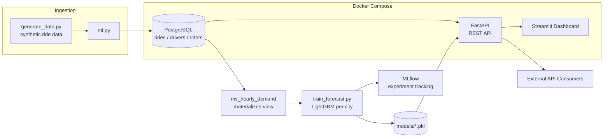

# 🚕 Uber End-to-End Analytics & Demand Forecasting Platform

A production-style data platform that ingests ride-hailing data, stores it in
PostgreSQL, serves analytics through a REST API, forecasts demand with a
gradient-boosted time-series model, and visualizes everything in an
interactive dashboard — fully containerized with Docker.

> Built as a portfolio project to demonstrate SQL, Python, ML/time-series
> forecasting, API design, and deployment skills end-to-end.

---

## Architecture



**Flow in one line:** synthetic data → Postgres → materialized view →
LightGBM forecasting model (tracked in MLflow) → FastAPI → Streamlit
dashboard, all orchestrated by `docker-compose`.

---

## Features

| Module | What it does |
|---|---|
| **Ride demand analysis** | Hourly/daily demand patterns by city, rush-hour detection |
| **Surge pricing analysis** | Surge multiplier trends vs. cancellation rate correlation |
| **Driver performance** | Earnings, ratings, completion rate per driver |
| **Revenue analytics** | Daily revenue, day-over-day growth % |
| **Geo-spatial hotspots** | Clustered pickup-demand map data |
| **Demand forecasting** | LightGBM model per city, iterative multi-step forecast, MLflow-tracked |
| **REST API** | FastAPI, auto-generated OpenAPI docs at `/docs` |
| **Dashboard** | Streamlit, calls the API only (mirrors real client architecture) |
| **Deployment** | Docker + docker-compose, GitHub Actions CI |

---

## Tech Stack

`PostgreSQL` · `SQL (window functions, materialized views)` · `Python` ·
`Pandas / NumPy` · `LightGBM` · `MLflow` · `FastAPI` · `Streamlit` ·
`Plotly` · `Docker` · `GitHub Actions`

---

## Project Structure

```
uber-analytics-platform/
├── data/generate_data.py       # synthetic dataset generator
├── sql/schema.sql              # tables, indexes, materialized view
├── sql/analytics_queries.sql   # standalone reference queries
├── src/
│   ├── db.py                   # SQLAlchemy engine/session
│   ├── etl.py                  # CSV -> Postgres loader
│   ├── analytics.py            # reusable query functions
│   ├── features.py             # time-series feature engineering
│   └── train_forecast.py       # LightGBM training + MLflow logging
├── api/
│   ├── main.py                 # FastAPI app
│   ├── schemas.py               # Pydantic response models
│   └── routers/                # demand / surge / drivers / revenue
├── dashboard/app.py             # Streamlit UI
├── Dockerfile                   # API image
├── docker/Dockerfile.dashboard  # Dashboard image
├── docker-compose.yml           # Postgres + API + Dashboard
└── .github/workflows/ci.yml     # lint + build on push
```

---

## Setup — Local (without Docker)

```bash
# 1. Clone and install
git clone https://github.com/<your-username>/uber-analytics-platform.git
cd uber-analytics-platform
python -m venv venv && source venv/bin/activate    # Windows: venv\Scripts\activate
pip install -r requirements.txt

# 2. Start Postgres (any local instance) and set env vars
cp .env.example .env    # edit if your DB creds differ
export $(cat .env | xargs)

# 3. Create schema
psql -h localhost -U uber_admin -d uber_analytics -f sql/schema.sql

# 4. Generate synthetic data + load into Postgres
python data/generate_data.py --rides 200000 --days 120 --out data/rides.csv
python src/etl.py

# 5. Train the forecasting models (one per city)
python src/train_forecast.py

# 6. Run the API
uvicorn api.main:app --reload --port 8000
# Docs: http://localhost:8000/docs

# 7. Run the dashboard (new terminal)
streamlit run dashboard/app.py
```

---

## Setup — Docker (recommended, one command)

```bash
docker-compose up --build
```

This starts:
- **Postgres** on `localhost:5432` (schema auto-applied on first boot)
- **FastAPI** on `localhost:8000` (docs at `/docs`)
- **Streamlit dashboard** on `localhost:8501`

Then, from the host machine, generate data + train the model once:

```bash
pip install -r requirements.txt
python data/generate_data.py --rides 200000 --out data/rides.csv
POSTGRES_HOST=localhost python src/etl.py
POSTGRES_HOST=localhost python src/train_forecast.py
docker-compose restart api      # pick up the newly trained models/
```

---

## API Endpoints

| Method | Endpoint | Description |
|---|---|---|
| GET | `/demand/hourly` | Demand by hour-of-day / day-of-week |
| GET | `/demand/hotspots` | Geo-clustered pickup demand |
| GET | `/demand/forecast?city=Delhi&hours_ahead=24` | ML-based demand forecast |
| GET | `/surge/analysis` | Surge vs. cancellation-rate trend |
| GET | `/drivers/performance` | Driver earnings, ratings, completion rate |
| GET | `/revenue/trend` | Daily revenue + growth % |

Full interactive spec: `http://localhost:8000/docs`

---

## Design Notes (why it's built this way)

- **Materialized view (`mv_hourly_demand`)** pre-aggregates rides so the
  forecasting model and dashboard never scan the raw `rides` table — this is
  how real analytics platforms keep dashboards fast at scale.
- **Lag + rolling-window features** (1h/24h/168h) instead of a black-box deep
  model — easier to explain, debug, and productionize with tabular data of
  this size; a standard industry approach for hourly demand forecasting.
- **Dashboard talks to the API, not the DB** — same contract a mobile app or
  third party would use, so the analytics logic lives in exactly one place.
- **MLflow tracking** — every training run is logged with parameters and
  metrics, so model iterations are reproducible and comparable.

---

## Possible Extensions

- Add Airflow to schedule `etl.py` + `train_forecast.py` on a daily cadence
- Deploy `api` + `dashboard` to a cloud VM / ECS / Cloud Run behind a reverse proxy
- Add authentication (API keys / OAuth) on the FastAPI routes
- Swap LightGBM for Prophet/ARIMA as a benchmark comparison in `train_forecast.py`

---

## License

MIT — free to use and adapt.
